# ImHex MCP Python Library Architecture

## Overview

This document covers the architecture of the ImHex MCP **Python client library** (`lib/` directory), which provides high-performance, feature-rich clients for interacting with the ImHex MCP server. This complements the main [ARCHITECTURE.md](ARCHITECTURE.md) which covers the C++ plugin and overall system architecture.

## Table of Contents

1. [System Architecture](#system-architecture)
2. [Component Architecture](#component-architecture)
3. [Data Flow Architecture](#data-flow-architecture)
4. [Caching Architecture](#caching-architecture)
5. [Security Architecture](#security-architecture)
6. [Performance Architecture](#performance-architecture)
7. [Deployment Architecture](#deployment-architecture)

---

## System Architecture

### High-Level System Overview

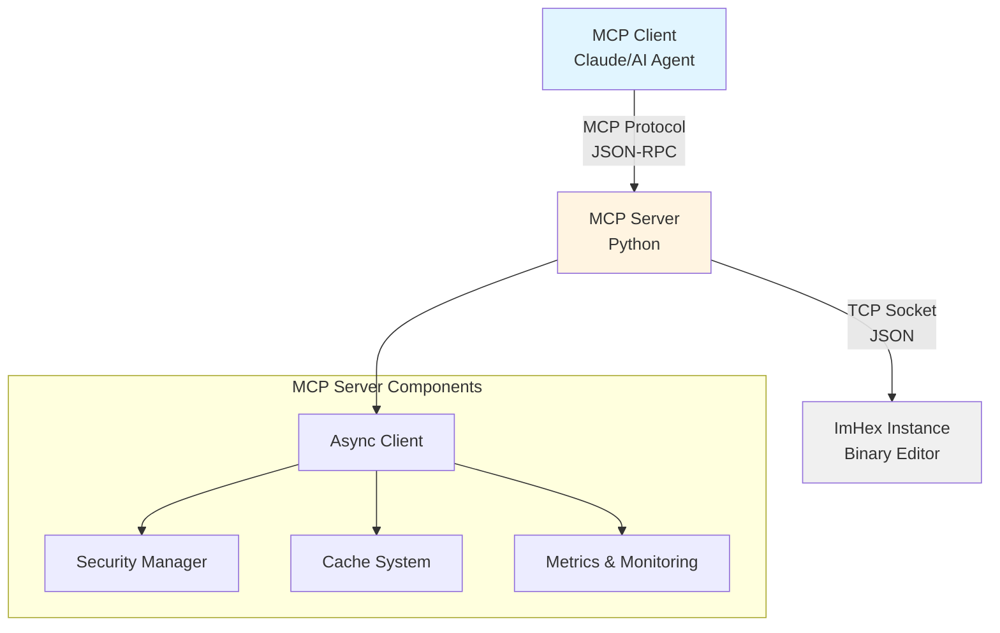

### Technology Stack

| Layer | Technology | Purpose |
|-------|-----------|---------|
| **Client** | MCP Protocol | Standard protocol for AI agents |
| **Server** | Python 3.10+ | Async I/O, high performance |
| **Communication** | JSON-RPC over TCP | Socket-based communication |
| **Backend** | ImHex C++ | Binary analysis engine |
| **Caching** | In-memory LRU | Performance optimization |
| **Security** | Custom validation | Input validation & rate limiting |
| **Monitoring** | Prometheus | Metrics and observability |

---

## Component Architecture

### Core Components

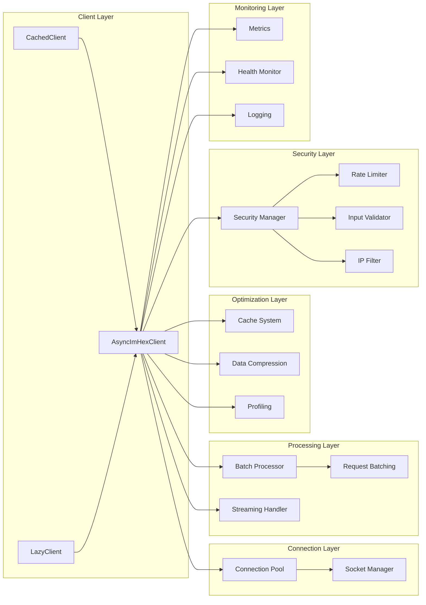

### Module Dependency Graph

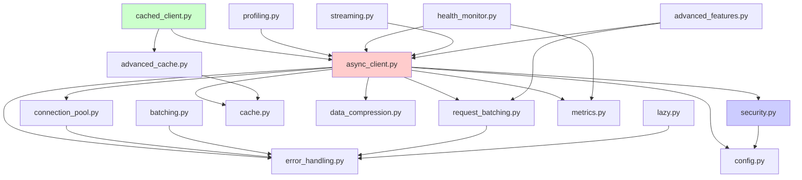

---

## Data Flow Architecture

### Request Processing Flow

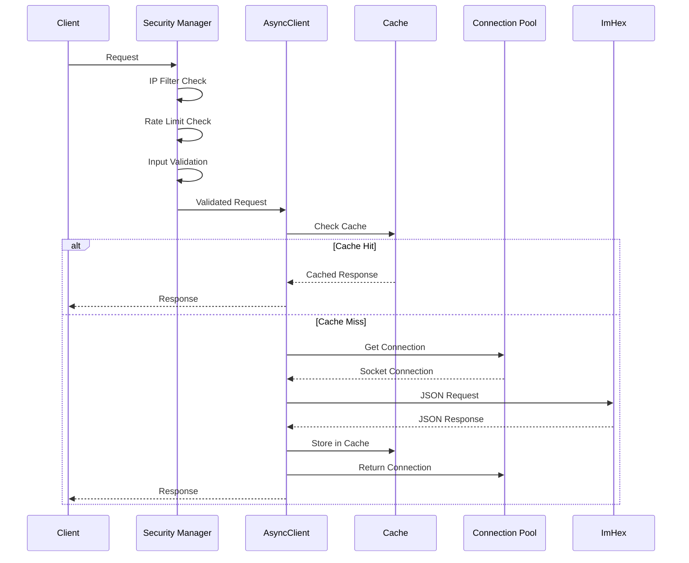

### Batch Processing Flow

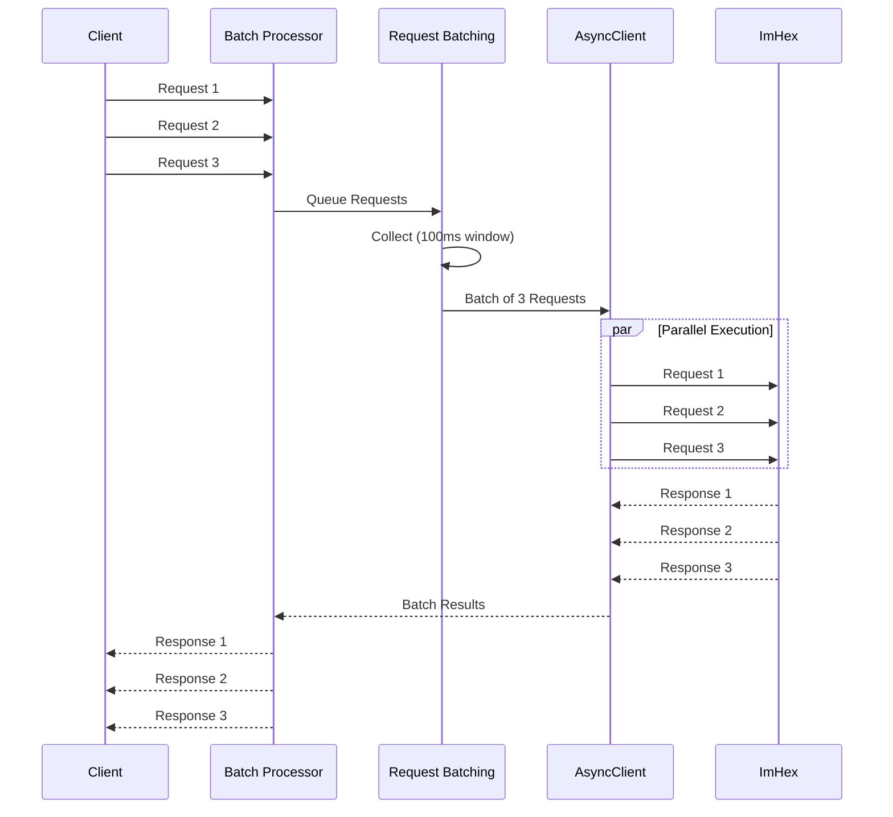

### Streaming Data Flow

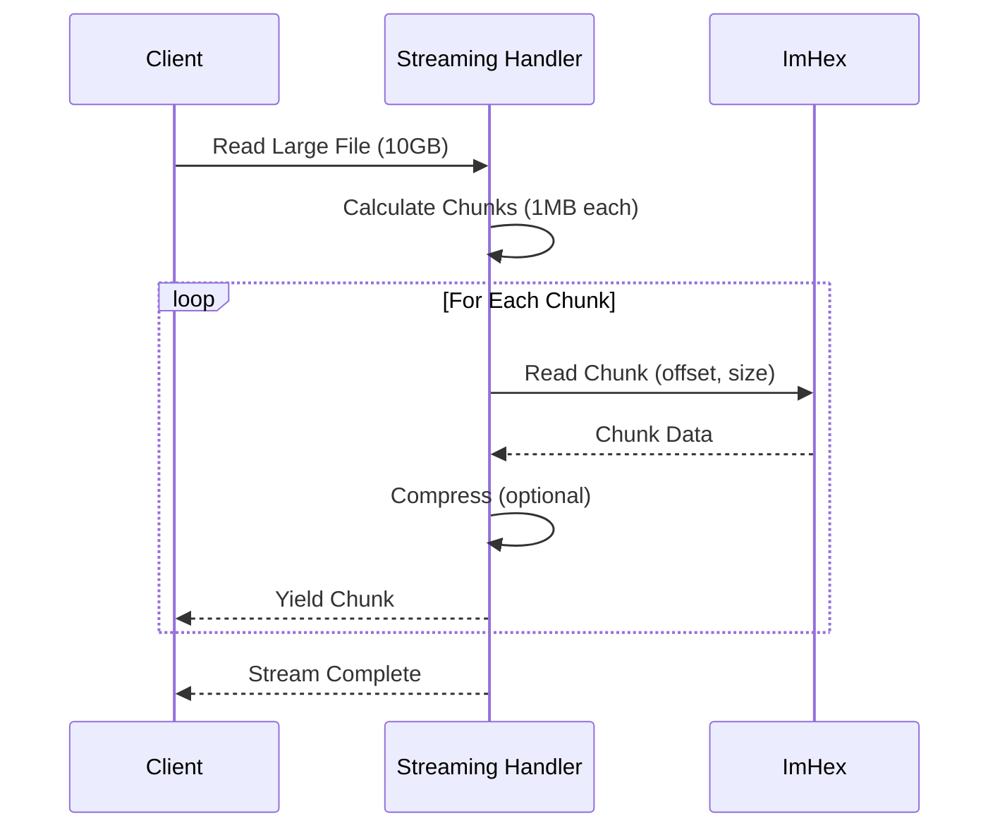

---

## Caching Architecture

### Two-Tier Cache System

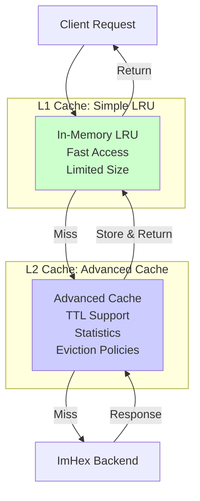

### Cache Key Strategy

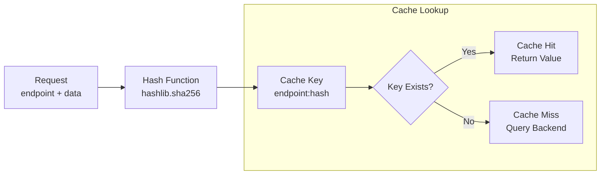

### Cache Invalidation

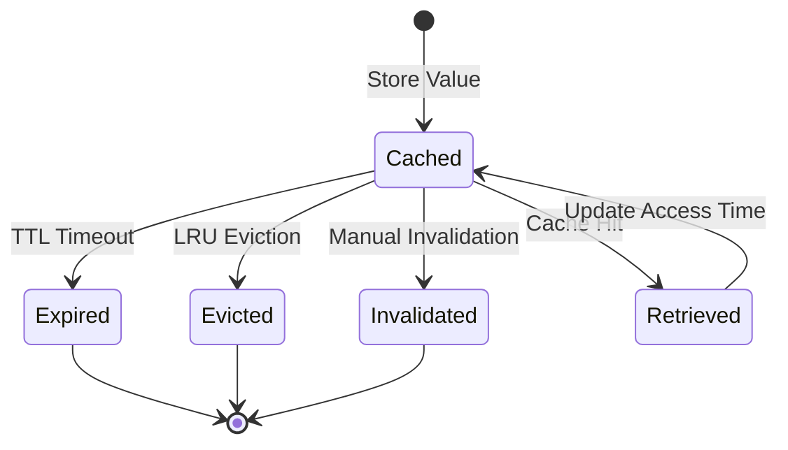

---

## Security Architecture

### Defense in Depth

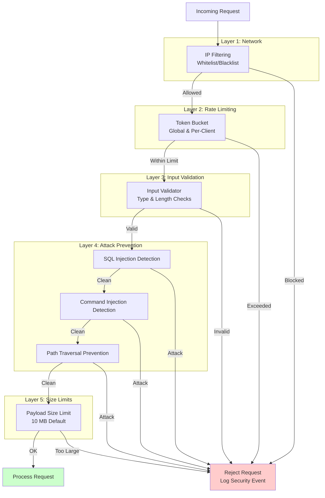

### Security Event Flow

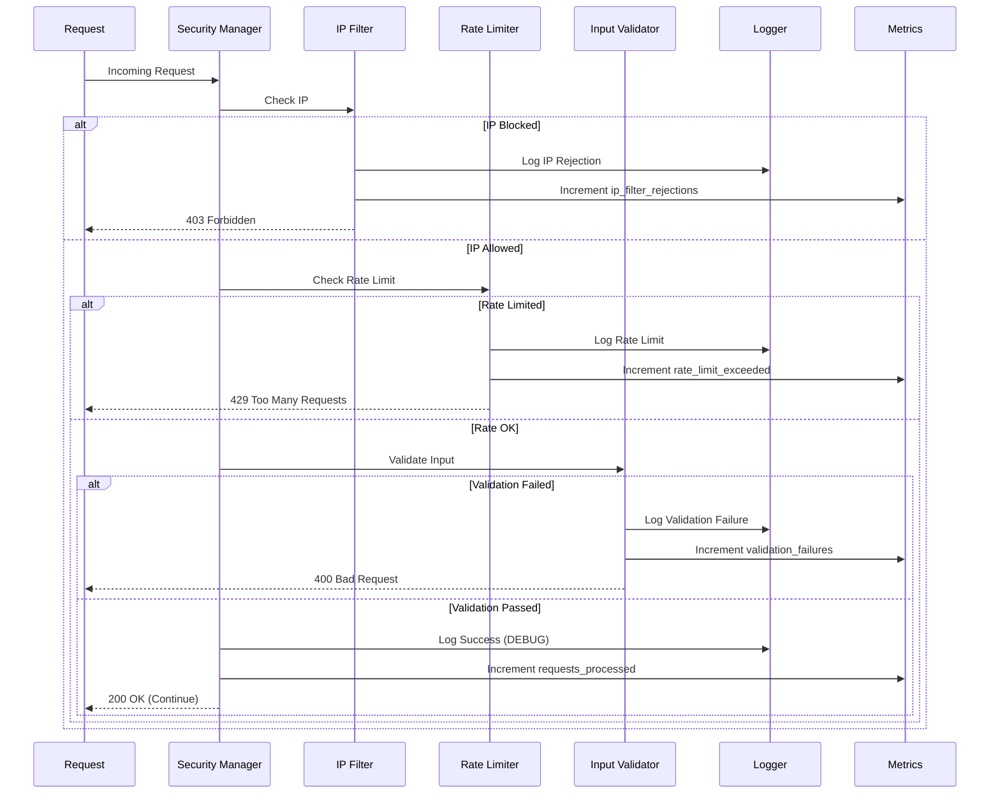

---

## Performance Architecture

### Optimization Layers

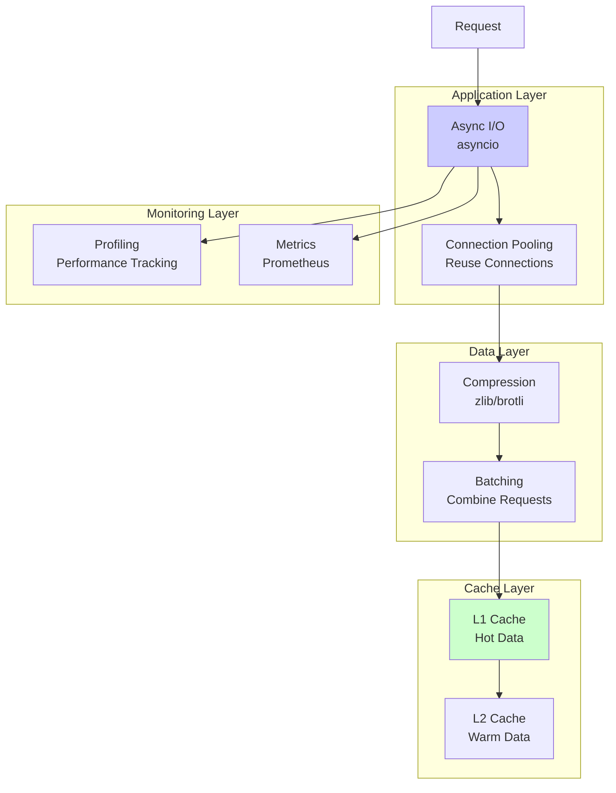

### Performance Metrics

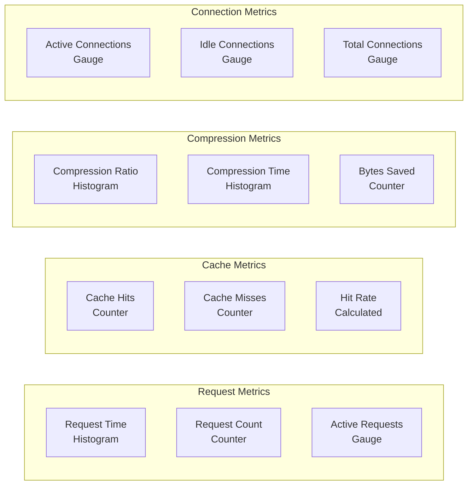

---

## Deployment Architecture

### Production Deployment

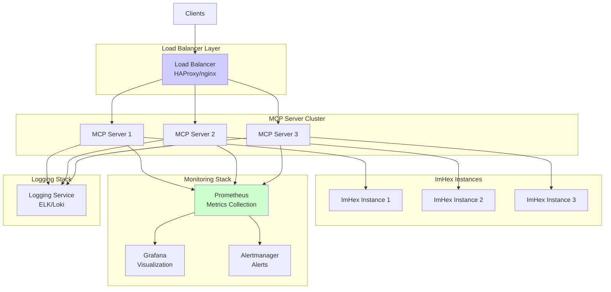

### Docker Deployment

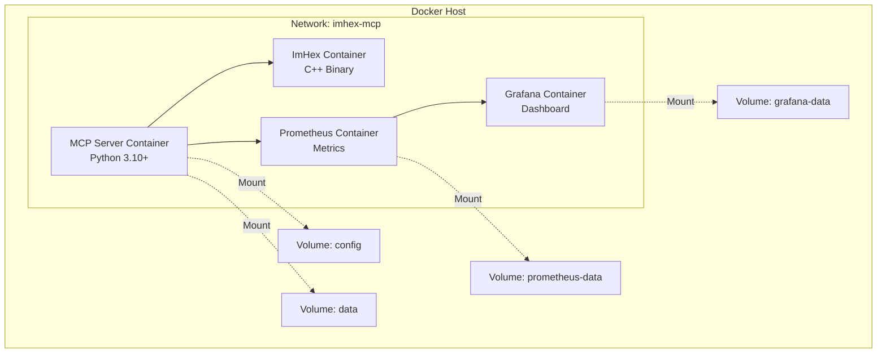

---

**Version**: 1.0
**Last Updated**: 2025-11-14
**Maintained By**: ImHex MCP Team
